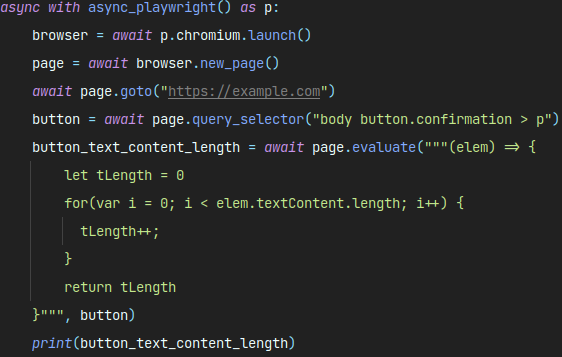
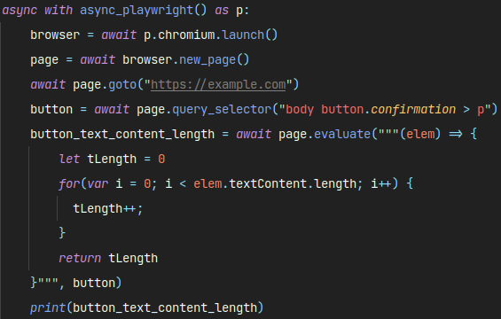
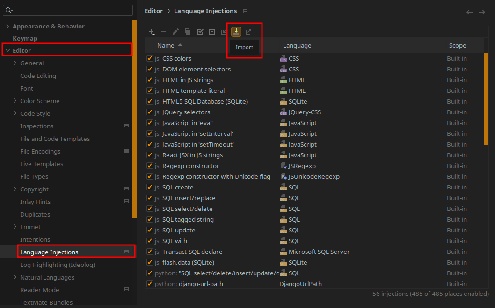

## playwright-python-language-injection

### Demo

#### Before

#### After

### What is this?

This repo contains the script to generate [language injection](https://www.jetbrains.com/help/pycharm/using-language-injections.html) definitions for using [playwright-python](https://github.com/microsoft/playwright-python) in PyCharm. From the link:

> Language injections let you work with pieces of code in other languages embedded in your code. When you inject a language (such as HTML, CSS, XML, RegExp, and so on) into a string literal, you get comprehensive code assistance for editing that literal.

## How do I use this?

The script `generate.py` generates a file `playwright-X.xml` where X is the major component of the installed playwright version. Or, you can just download the [last generated version directly](./playwright-1.xml).

After downloading, open up your settings in PyCharm → Editor → Language Injections → Import, and select the file you just downloaded.

### How does this work?

Since the developers of `playwright-python` were consistent with their style, that made this script a lot easier to write. Every single occurrence of a CSS selector argument in a function uses the name `selector` and every occurrence of a JS expression uses the argument name `expression`. So it's as simple as iterating over the entire API surface, and finding methods that have arguments that match the name and type annotation of `str`. Both async and sync APIs are supported.
